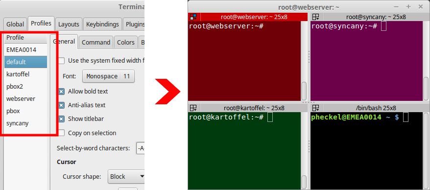

# Terminator HostWatch Plugin
This plugin monitors the last line (PS1) of each terminator terminal, and applies a host-specific profile if the hostname is changed. 

As of now, the plugin simply parses the PS1-evaluated last line and matches it against the regex `[^@]+@(\w+)` (e.g. to match `user@host`).

## Installation
Put the `hostWatch.py` in `/usr/share/terminator/terminatorlib/plugins/` or `~/.config/terminator/plugins/`. Then create a profile in Terminator to match your hostname. If you have a server that displays `user@myserver ~ $`, for instance, create a profile called `myserver`.



## Configuration
For now, the only setting you can change is the regex patterns the plugin will react on. The default pattern is `[^@]+@(\w+)` (e.g. `user@host`). To change that, add this to your .config/terminator/config file and adjust the regexes accordingly:

```
[plugins]
  [[HostWatch]]
    patterns = "[^@]+@(\w+):([^#]+)#", "[^@]+@(\w+) .+ \$"
```
## Development
Development resources for the Python Terminator class and the 'libvte' Python bindings can be found here:

For terminal.* methods, see: 
  - http://bazaar.launchpad.net/~gnome-terminator/terminator/trunk/view/head:/terminatorlib/terminal.py
  - and: `apt-get install libvte-dev; less /usr/include/vte-0.0/vte/vte.h`

For terminal.get_vte().* methods, see:
  - https://github.com/linuxdeepin/python-vte/blob/master/python/vte.defs
  - and: `apt-get install libvte-dev; less /usr/share/pygtk/2.0/defs/vte.defs`

## Debugging
To debug the plugin, start Terminator from another terminal emulator 
like this:

```
$ terminator --debug-classes=HostWatch
```

That should give you output like this:

```
   HostWatch::check_host: switching to profile EMEA0014, because line 'pheckel@EMEA0014 ~ $ ' matches pattern '[^@]+@(\w+)'
   HostWatch::check_host: switching to profile kartoffel, because line 'root@kartoffel:~# ' matches pattern '[^@]+@(\w+)'
   ...
```

## Authors
The plugin was developed by GratefulTony (https://github.com/GratefulTony/TerminatorHostWatch), 
and extended by Philipp C. Heckel (https://github.com/binwiederhier/TerminatorHostWatch).

## License
The plugin is licensed as GPLv2 only.
